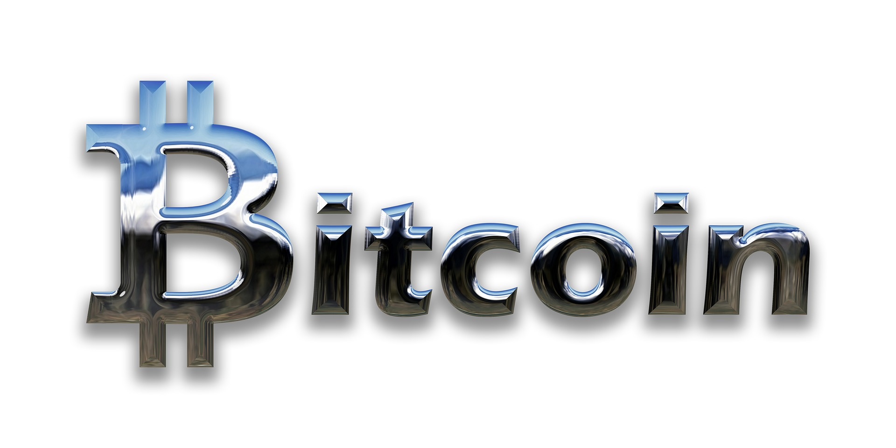

## 
<b> Project Overview</b> 

Stream `Real-time` prices of bitcoin prices with a higher ranking on a `one-minute` interval using `Apache Kafka`.Streaming is enabled by use of the `CoinCap API` which displays real-time data of bitcoin prices. 

